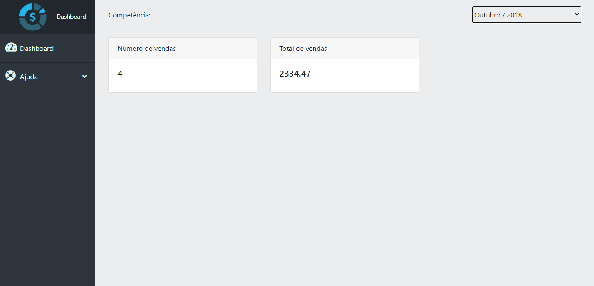
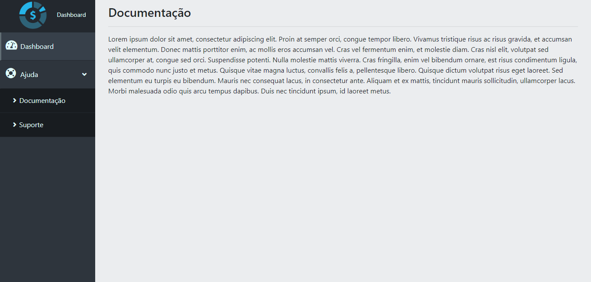
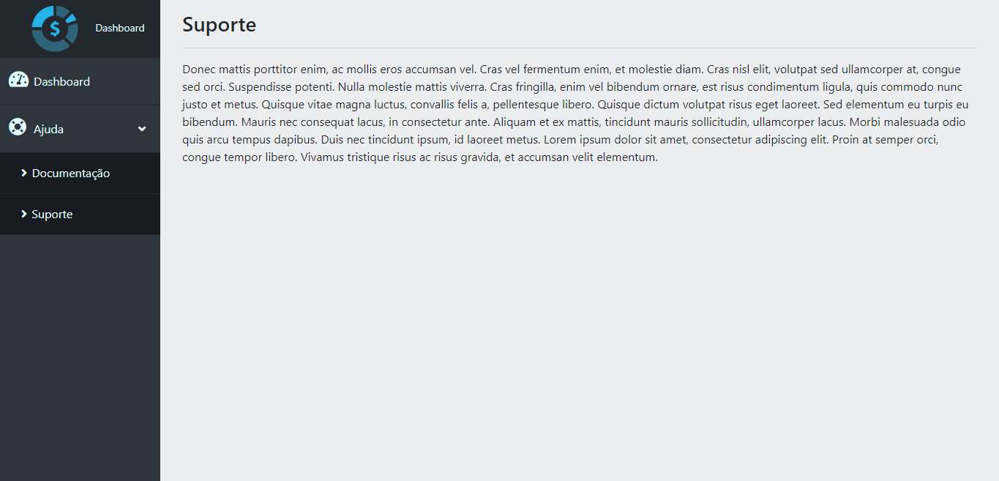

## Página feita com jQuery e AJAX sem reflesh de página

<h2>Imagens do site</h2>
 

 

 

 

 

## Referências
[Desenvolvimento Web Completo - 20 cursos + 20 projetos](https://www.udemy.com/course/web-completo/?gclid=CjwKCAiA0JKfBhBIEiwAPhZXD40I4ExfSm1TervrIYaoqk51tJUNfxUSbePnlDnNbF-p6QtRTIDqPBoCexUQAvD_BwE)

